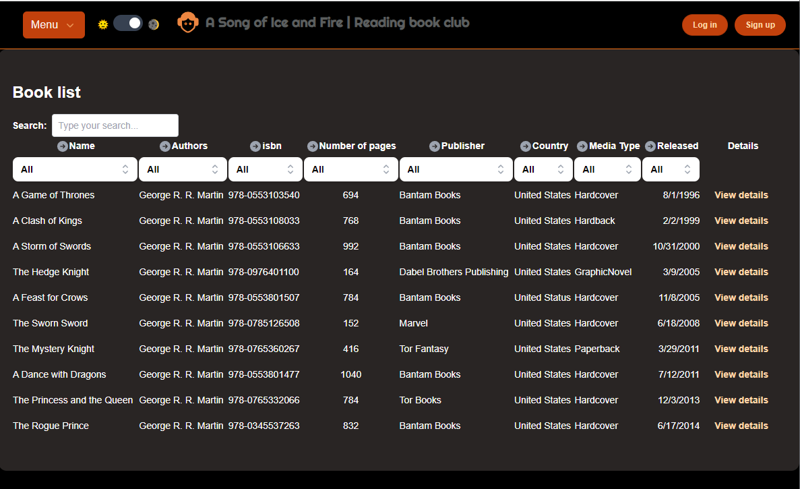
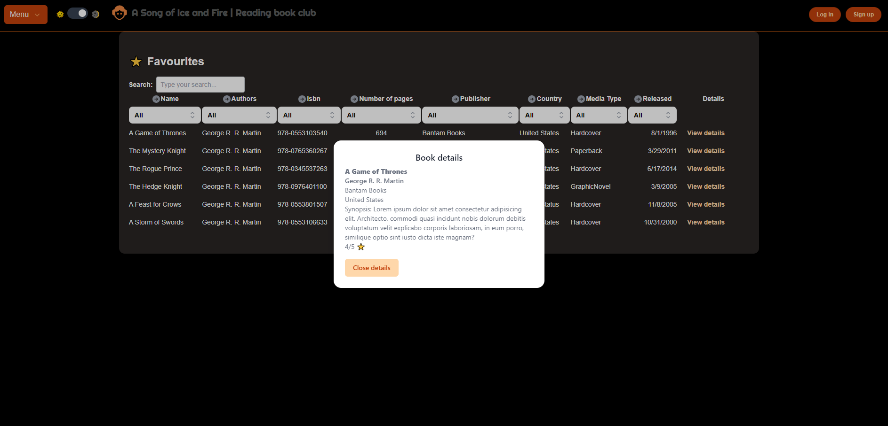

# A song of ice and fire | Book Library

## Índice

* [1. Introducción](#1-introducción)
* [2. Librerías](#2-librerías)
* [3. Ejecutar la aplicación](#3-ejecutar-la-aplicación)
* [4. Diseño y estructura](#4-diseño-y-estructura)
* [5. Mejoras pendientes](#5-mejoras-pendientes)
* [6. Deadline](#6-deadline)
* [7. Issues](#7-issues)

## 1. Introducción

Este proyecto consiste en un sitio web dedicado a la lectura de libros, desarrollado utilizando React, Vite y TypeScript. La idea de la plataforma es que ofrezca a los usuarios una experiencia intuitiva y atractiva para explorar, leer y gestionar su biblioteca digital.

El sitio permite:

- Simulación de Login y Logout
- Menú desplegable para navegar entre las páginas
- Modo dark y light
- Búsqueda manual
- Filtrar por cada columna
- Ordenar asc/desc cada columna utilizando el ícono circle-arrow
- Visualización de detalles de cada libro
- Añadir a favoritos
- Llenar campos para subir un nuevo libro en la página

## 2. Librerías

Las librerías que se utilizaron se enlistan aquí:

### Headless UI:

Headless UI es una biblioteca que proporciona componentes de interfaz de usuario (UI) accesibles y totalmente personalizables, pero sin estilos predeterminados. Está diseñada para ser utilizada con bibliotecas de diseño como Tailwind CSS o frameworks de estilo personalizados. La característica principal de Headless UI es que ofrece una capa sin estilos (headless) que permite tener un control total sobre la apariencia y comportamiento de los componentes sin sacrificar la accesibilidad.

Utilizado para crear los componentes de BookDialog, Toggle, PopOver y el List Box de la tabla para filtrar los libros.

### Heroicon:

Heroicons es una biblioteca de iconos diseñada para ser simple, consistente y fácil de usar en proyectos web. La ventaja de Heroicons sobre emoticonos radica en su versatilidad y capacidad de adaptarse a diversas interfaces de usuario. Mientras que los emoticonos son imágenes prediseñadas que a menudo tienen un estilo específico que no siempre encaja con el diseño que se quiere mostrar, los iconos de Heroicons son completamente personalizables en términos de color, tamaño y estilo. 

Usado en los iconos para ordenar y filtrar la tabla. (CircleArrows & Chevrons)

### Axios:

Simplifica la gestión de solicitudes HTTP, proporciona funciones adicionales como la cancelación de peticiones y la transformación automática de datos. Además de que ofrece una interfaz más intuitiva y consistente en comparación con un fetch tradicional.

Usado en la petición GET a la API.

### Formik:

Formik es una biblioteca de gestión de formularios en React que simplifica y mejora significativamente la construcción y gestión de formularios en comparación con la creación manual de formularios. 

Usado en la maquetación del form para agregar nuevos libros a la biblioteca.

### Tailwind:

Tailwind se centra en proporcionar clases de estilo directamente aplicables en HTML para diseñar componentes y páginas de manera más flexible. Está diseñado para ser altamente personalizable y adaptable a diferentes proyectos, permitiendo crear diseños consistentes y eficientes.

## 3. Ejecutar la aplicación

Para ejecutar la aplicación, se debe clonar el repositorio y ejecutar el comando `npm install` para instalar las dependencias. Luego, se debe ejecutar el comando `npm run dev` para iniciar el servidor en local, normalmente en el puerto : 5173. 

## 4. Diseño y estructura

El diseño de la aplicación se realizó utilizando Tailwind CSS y se utilizó react-table para mostrar los libros de la biblioteca. 
La idea principal es que el usuario sea capaz de identificar de manera rápida el libro que busca y pueda agregarlo a sus favoritos, a los que puede acceder usando el único menú disponible que contiene las tres vistas de la aplicación.

La aplicación cuenta con un modo oscuro y un modo claro para mayor comodidad visual del usuario.

## 5. Mejoras pendientes

### Mejoras al diseño:

- Mejorar el diseño del header y footer para que sea más atractivo visualmente.
- Iconos más apropiados en el menú desplegable.
- Realizar una mejor maquetación del formulario para agregar libros.
- Que el sitio sea responsive.

### Mejoras pendientes al proyecto:

- Testing
- Stories

## 6. Deadline

- Realizar cada componente con su respectiva storie y prueba unitaria.
- Realizar la documentación de la aplicación.

## 7. Issues

- React table vs React v18 (Solucionado)
- React v18 vs Jest (En progreso)
- Storybook (Faltan componentes)

