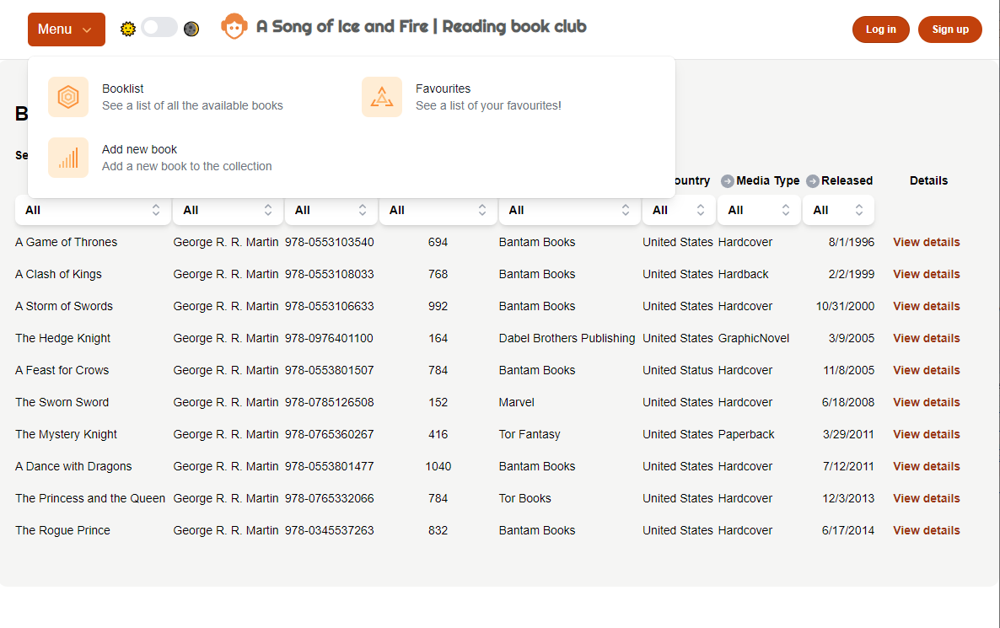

# A song of ice and fire | Book Library

## Índice

* [1. Introducción](#1-introducción)
* [2. Librerías](#2-librerías)
* [3. Ejecutar la aplicación](#3-ejecutar-la-aplicación)
* [4. Diseño y estructura](#4-diseño-y-estructura)
* [5. Mejoras pendientes](#5-mejoras-pendientes)
* [6. Deadline](#6-deadline)
* [7. Issues](#7-issues)

## 1. Introducción

Este proyecto consiste en un sitio web dedicado a la lectura de libros, desarrollado utilizando las tecnologías React, Vite y TypeScript. La idea de la plataforma es que ofrezca a los usuarios una experiencia intuitiva y atractiva para explorar, leer y gestionar su biblioteca digital.

El sitio permite:

- Simulación de Login y Logout
- Menú desplegable para navegar entre las páginas
- Modo dark y light
- Búsqueda manual
- Filtrar por cada columna
- Ordenar asc/desc cada columna utilizando el ícono circle-arrow
- Visualización de detalles de cada libro
- Añadir a favoritos
- Llenar campos para subir un nuevo libro (maquetación) en la página "Add new book"

## 2. Librerías

Las librerías que se utilizaron se enlistan aquí:

### Headless UI:

Headless UI es una biblioteca que proporciona componentes de interfaz de usuario (UI) accesibles y totalmente personalizables, pero sin estilos predeterminados. Está diseñada para ser utilizada con bibliotecas de diseño como Tailwind CSS o frameworks de estilo personalizados. La característica principal de Headless UI es que ofrece una capa sin estilos (headless) que permite tener un control total sobre la apariencia y comportamiento de los componentes sin sacrificar la accesibilidad.

Utilizado para crear los componentes de BookDialog, Toggle, PopOver y el List Box de la tabla para filtrar los libros.

### Heroicon:

Heroicons es una biblioteca de iconos diseñada para ser simple, consistente y fácil de usar en proyectos web. La ventaja de Heroicons sobre emoticonos radica en su versatilidad y capacidad de adaptarse a diversas interfaces de usuario. Mientras que los emoticonos son imágenes prediseñadas que a menudo tienen un estilo específico que no siempre encaja con el diseño que se quiere mostrar, los iconos de Heroicons son completamente personalizables en términos de color, tamaño y estilo. 

Usado en los iconos para ordenar y filtrar la tabla. (CircleArrows & Chevrons)

### Axios:

Simplifica la gestión de solicitudes HTTP, proporciona funciones adicionales como la cancelación de peticiones y la transformación automática de datos. Además de que ofrece una interfaz más intuitiva y consistente en comparación con un fetch tradicional.

Usado en la petición GET a la API.

### Formik:

Formik es una biblioteca de gestión de formularios en React que simplifica y mejora significativamente la construcción y gestión de formularios en comparación con la creación manual de formularios. 

Usado en la maquetación del form para agregar nuevos libros a la biblioteca.

### Tailwind:

Tailwind se centra en proporcionar clases de estilo directamente aplicables en HTML para diseñar componentes y páginas de manera más flexible. Está diseñado para ser altamente personalizable y adaptable a diferentes proyectos, permitiendo crear diseños consistentes y eficientes.

## 3. Ejecutar la aplicación

Para ejecutar la aplicación, se debe clonar el repositorio y ejecutar el comando `npm install` para instalar las dependencias. Luego, se debe ejecutar el comando `npm run dev` para iniciar el servidor en local, normalmente en el puerto : 5173. 

## 4. Diseño y estructura

El diseño de la aplicación se realizó utilizando Tailwind CSS y se utilizó react-table para mostrar los libros de la biblioteca. La decisión de usar una vista sencilla fue para poder cumplir con la mayoría de los requisitos funcionales, sin dejar de lado el aspecto de la aplicación. 

Me interesaba que el usuario fuera capaz de identificar de manera rápida el libro que busca y pueda agregarlo a sus favoritos, a los que puede acceder usando el único menú disponible que contiene las tres vistas de la aplicación.

Al no haber imagenes de los libros en la API, desistí de la idea inicial que tenía, la cual era mostrar los libros como carátulas.

## 5. Mejoras pendientes

### Mejoras al diseño:

Me habría encantado poder dedicar más tiempo a diseñar el sitio, me quedó en el tintero buscar iconos diferentes para el menú y haber hecho un header y footer más atractivo  visualmente. 
Otra de las principales cosas que me queda pendiente es hacerlo responsive.

### Mejoras al proyecto:

Me gustaría haber tenido más tiempo para las pruebas unitarias y así poder tener un código probado y con buenas prácticas. 

Mejorar las stories. No alcancé a realizarlas todas ni de la mejor manera, ya que Storybook era algo completamente nuevo y tuve que aprender sobre la marcha. 

## 6. Deadline

Si hubiera tenido más tiempo ¿Qué hubiera hecho diferente? :

Me habría tomado un poco más de tiempo en el diseño de la app. Además de haber realizado cada componente con su respectiva storie y prueba unitaria de forma simultánea; Al haberlas dejado para el final y, sin contemplar posibles contratiempos, me ha llegado la deadline encima y no me quedó tiempo para completar todos esos requisitos.

## 7. Issues

En este proyecto enfrenté muchos desafíos, entre los que puedo destacar: usar Typescript junto con la última versión de React e implementar una tabla usando react-table. La mayoría de los problemas que me encontré fueron relacionados con el uso de la librería react-table y la poca compatibilidad de React v18 con algunas dependencias utilizadas, principalmente Jest. 

Storybook también fue un contrincante difícil, ya que no tenía experiencia previa con esta herramienta y me di cuenta ya con el proyecto avanzado que lo mejor habría sido crear cada componente con su respectiva storie en vez de dejarlas hasta el final.

De todas formas, destaco que este proyecto me abrió un mundo de nuevas posibilidades con librerías y herramientas nuevas y entrego muy satisfecha de haber podido dar lo mejor de mi en esta semana de desarrollo. 

